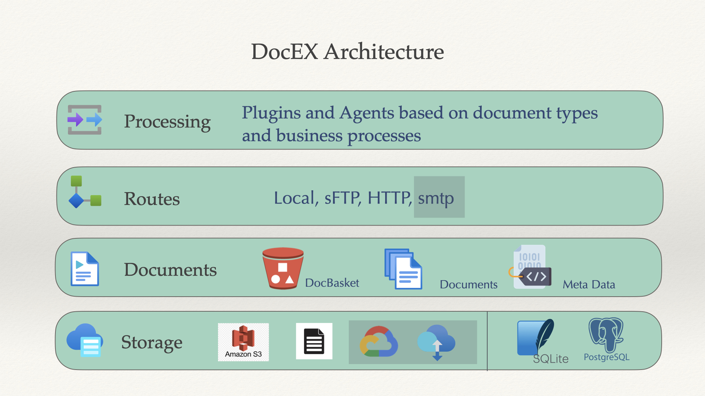

# DocEX

<!-- Badges -->


<!-- Add PyPI badge here when ready -->



**DocEX** is a lean document storage, metadata, vector indexing, and transport library for Python. LLM and RAG orchestration are intentionally kept out of the core package and provided as copy-adapt examples under `examples/`.

**Current Version: 3.0.0** - This release focuses DocEX core on storage, metadata, transport, and provider-neutral vector indexing. See [docs/MIGRATION_3_0.md](docs/MIGRATION_3_0.md) for migration notes.

## Features

- 📁 Document storage and metadata management
- 🔄 Transport layer with pluggable protocols (local, SFTP, HTTP, etc.)
- 🛣️ Configurable transport routes and routing rules
- 📝 Operation and audit tracking
- 📊 **Vector indexing & semantic search** - Bring your own embedding function
- ☁️ **S3 storage support** - Store documents in Amazon S3
- 🏢 **Multi-tenancy support** - Database-level isolation for secure multi-tenant deployments
- 🔐 **Enhanced security** - UserContext for audit logging and tenant routing

## Installation

### Base Installation (Lightweight)

Install the lightweight base package from PyPI:

```sh
pip install docex
```

This installs only the core dependencies needed for basic document management with SQLite. Perfect for getting started or when you don't need advanced features.

### Optional Dependencies

DocEX uses optional dependency groups to keep the base installation lightweight. Install only what you need:

```sh
# PostgreSQL database support
pip install docex[postgres]

# Vector indexing and semantic search
pip install docex[vector]

# Amazon S3 storage backend
pip install docex[storage-s3]

# HTTP transport method
pip install docex[transport-http]

# SFTP transport method
pip install docex[transport-sftp]

# PDF text extraction
pip install docex[pdf]

# Word document text extraction
pip install docex[docx]

# All optional features
pip install docex[all]

# Development dependencies (testing, linting, etc.)
pip install docex[dev]
```

**Combine multiple features:**
```sh
pip install docex[postgres,vector]
pip install docex[all,dev]  # All features + dev tools
```

### Development Installation (Editable)

For development, install in editable mode:

```sh
# Lightweight editable install
pip install -e .

# Editable with all features
pip install -e ".[all,dev]"
```

This allows you to edit the source code and see changes immediately without reinstalling.

### What's Included in Base Installation?

The base installation includes:
- ✅ SQLite database support
- ✅ Filesystem storage
- ✅ Local transport
- ✅ Core document management
- ✅ Metadata management
- ✅ Basic CLI commands

**Not included** (install via optional dependencies):
- ❌ PostgreSQL support → `docex[postgres]`
- ❌ Vector indexing/semantic search → `docex[vector]`
- ❌ S3 storage → `docex[storage-s3]`
- ❌ HTTP/SFTP transport → `docex[transport-http]` / `docex[transport-sftp]`
- ❌ PDF/DOCX processing → `docex[pdf]` / `docex[docx]`

See [Dependency Optimization Guide](docs/DEPENDENCY_OPTIMIZATION.md) for detailed information.

## Quick Start

Before using DocEX in your code, you must initialize the system using the CLI:

```sh
# Run this once to set up configuration and database
$ docex init
```

Then you can use the Python API (minimal example):

```python
from docex import DocEX
from pathlib import Path

# Create DocEX instance (will check initialization internally)
docEX = DocEX()

# Create a basket
basket = docEX.create_basket('mybasket')

# Create a simple text file
hello_file = Path('hello.txt')
hello_file.write_text('Hello scos.ai!')

# Add the document to the basket
doc = basket.add(str(hello_file))

# Print document details — access fields as attributes, e.g. record.name, record.status
details = doc.get_details()
print(details.name, details.status, details.created_at)

hello_file.unlink()
```

These methods return typed `BasketRecord` and `DocumentRecord` instances instead of plain dictionaries.

### Security and Multi-Tenancy

DocEX includes enhanced security features and multi-tenancy support:

```python
from docex import DocEX
from docex.context import UserContext

# Create UserContext for audit logging and multi-tenancy
user_context = UserContext(
    user_id="alice",
    user_email="alice@example.com",
    tenant_id="tenant1",  # For multi-tenant applications
    roles=["admin"]
)

# Initialize DocEX with UserContext (enables audit logging)
docEX = DocEX(user_context=user_context)

# All operations are logged with user context
basket = docEX.create_basket("invoices")
```

**Multi-Tenancy Models:**
- **Database-Level Isolation** (Model B) - Each tenant has separate database/schema (✅ Implemented in 2.2.0)
- **Row-Level Isolation** (Model A) - Shared database with tenant_id columns (Proposed)

See [Multi-Tenancy Guide](docs/MULTI_TENANCY_GUIDE.md) and [Security Best Practices](examples/SECURITY_BEST_PRACTICES.md) for details.

### LLM/RAG Integration Examples

DocEX core does not ship LLM adapters, prompt templates, RAG services, or domain-specific extractors. Reference implementations live in:

- `examples/integrations/` for OpenAI, Anthropic, and local LLM adapter examples.
- `examples/patterns/` for RAG, knowledge base, advanced chunking, and invoice extraction patterns.

### Vector Indexing and Semantic Search

DocEX includes vector indexing and semantic search capabilities (requires `docex[vector]`). You provide the embedding function:

```python
from docex import DocEX
from docex.processors.vector import VectorIndexingProcessor, SemanticSearchService
import asyncio

def embed(text: str) -> list[float]:
    # Replace with your provider/model of choice.
    return [float(len(text) % 10), 1.0, 0.0]

# Initialize DocEX
docEX = DocEX()
basket = docEX.create_basket('my_basket')

# Add and index documents
document = basket.add('document.pdf')

# Create vector indexing processor
vector_processor = VectorIndexingProcessor(
    embedding_fn=embed,
    vector_db_type='memory'  # Use 'pgvector' for production
)

# Index document
await vector_processor.process(document)

# Perform semantic search
search_service = SemanticSearchService(
    doc_ex=docEX,
    embedding_fn=embed,
    vector_db_type='memory',
    vector_db_config={'vectors': vector_processor.vector_db['vectors']}
)

results = await search_service.search(
    query="What is machine learning?",
    top_k=5
)

for result in results:
    print(f"{result.document.name}: {result.similarity_score:.4f}")
```

**Vector Database Options:**
- **Memory** - For testing/development (no setup required)
- **pgvector** - PostgreSQL extension (recommended for production, handles up to 100M vectors)

See [Vector Search Guide](docs/VECTOR_SEARCH_GUIDE.md) for detailed documentation.

Additional examples can be found in the `examples/` folder.

## Configuration

Configure routes and storage in `default_config.yaml`:

```yaml
transport_config:
  routes:
    - name: local_backup
      purpose: backup
      protocol: local
      config:
        type: local
        name: local_backup_transport
        base_path: /path/to/backup
        create_dirs: true
      can_upload: true
      can_download: true
      enabled: true
  default_route: local_backup
```

## Documentation

- [Developer Guide](docs/Developer_Guide.md)
- [Design Document](docs/DocEX_Design.md)
- [Multi-Tenancy Guide](docs/MULTI_TENANCY_GUIDE.md)
- [Dependency Optimization Guide](docs/DEPENDENCY_OPTIMIZATION.md) - Lightweight installation and optional dependencies
- [Security Best Practices](examples/SECURITY_BEST_PRACTICES.md)
- [LLM Adapter Implementation](docs/LLM_ADAPTER_IMPLEMENTATION.md)
- [LLM Adapter Proposal](docs/LLM_ADAPTER_PROPOSAL.md)
- [Vector Search Guide](docs/VECTOR_SEARCH_GUIDE.md)
- [API Reference](docs/API_Reference.md)

## Contributing

Contributions are welcome! Please see [CONTRIBUTING.md](CONTRIBUTING.md) for guidelines.

## License

[MIT License](LICENSE)
