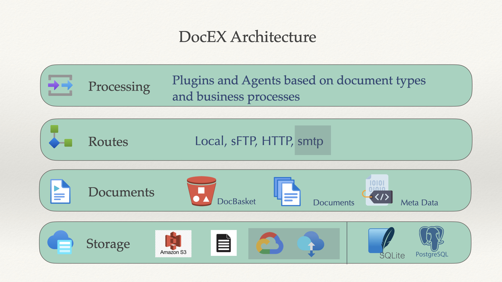

# DocEX Developer Guide

Welcome to the DocEX developer guide! This document will help you get started with DocEX, understand its core concepts, and extend it with your own processors and integrations.

---


## 1. Setup & Installation

1. **Install DocEX** (from PyPI or GitHub):
   ```sh
   pip install docex
   # or for latest development version:
   pip install git+https://github.com/tommyGPT2S/DocFlow.git
   ```
2. **Initialize DocEX** (run once per environment):
   ```sh
   docex init
   # Follow the prompts to set up config and database
   ```

---

## 2. Getting Started: DocEX, Baskets, and Documents

```python
from docex import DocEX

# Create DocEX instance
docEX = DocEX()

# Create or get a basket
basket = docEX.basket('mybasket')

# Add a document
doc = basket.add('path/to/file.txt', metadata={'source': 'example'})

# List all baskets
for b in docEX.list_baskets():
    print(b.name)
```

Please reference examples folders for sample files. 
---

## 3. Document Capabilities

- **Get document details:**
  ```python
  print(doc.get_details())
  ```
- **Get document content:**
  ```python
  text = doc.get_content(mode='text')
  data = doc.get_content(mode='json')
  bytes_data = doc.get_content(mode='bytes')
  ```
- **Get and update metadata:**
  ```python
  meta = doc.get_metadata()
  # Update metadata
  from docex.services.metadata_service import MetadataService
  MetadataService().update_metadata(doc.id, {'my_key': 'my_value'})
  ```
- **Get document operations:**
  ```python
  print(doc.get_operations())
  ```

---

## 4. Using Routes (Upload/Download)

- **List routes:**
  ```python
  for route in docEX.list_routes():
      print(route.name, route.protocol)
  ```
- **Download a file:**
  ```python
  route = docEX.get_route('my_download_route')
  result = route.download('remote_file.txt', 'local_file.txt')
  print(result.message)
  ```
- **Upload a document:**
  ```python
  upload_route = docEX.get_route('my_upload_route')
  result = upload_route.upload_document(doc)
  print(result.message)
  ```

---

## 5. Using Processors (Processing Documents)

- **List available processors:**
  ```sh
  docex processor list
  ```
- **Get a processor for a document:**
  ```python
  from docex.processors.factory import factory
  processor_cls = factory.map_document_to_processor(doc)
  if processor_cls:
      processor = processor_cls(config={})
      result = processor.process(doc)
      print(result.content)
  else:
      print('No processor found for this document.')
  ```

---

## 6. Building Your Own Processor

1. **Create a new processor class:**
   ```python
   from docex.processors.base import BaseProcessor, ProcessingResult
   from docex.document import Document
   from pdfminer.high_level import extract_text
   import io

   class MyPDFTextProcessor(BaseProcessor):
       def can_process(self, document: Document) -> bool:
           return document.name.lower().endswith('.pdf')

       def process(self, document: Document) -> ProcessingResult:
           pdf_bytes = document.get_content(mode='bytes')
           text = extract_text(io.BytesIO(pdf_bytes))
           return ProcessingResult(success=True, content=text)
   ```
2. **Dynamically add a processor mapping rule:**
   Instead of editing the main package, you can patch the processor mapping at runtime:
   ```python
   from docex.processors.factory import factory
   from my_pdf_text_processor import MyPDFTextProcessor

   def pdf_rule(document):
       if document.name.lower().endswith('.pdf'):
           return MyPDFTextProcessor
       return None

   factory.mapper.rules.insert(0, pdf_rule)  # Highest priority
   ```
   This allows you to use your custom processor for PDFs (or any custom logic) without modifying DocEX internals.
3. **Register your processor (optional):**
   ```sh
   docex processor register --name MyPDFTextProcessor --type content_processor --description "Extracts text from PDFs" --config '{}'
   ```
4. **Add a mapping rule (optional):**
   You can still edit `docex/processors/mapper.py` for static rules, but dynamic patching is recommended for custom/external processors.

---

## 7. Best Practices & Tips

- Always use the Document API for content and metadata access (never access storage directly).
- Use baskets to organize documents by business context.
- Use metadata to enrich and search documents.
- Add custom processors for your business logic and register them via the CLI.
- Keep mapping logic in `mapper.py` for easy extensibility.

---

## 8. Configuring Storage and Database Backends

DocEX supports multiple storage and database backends. You can configure these in your config file (usually `~/.docflow/config.yaml`) or during `docex init`.

### Change Database Backend to Postgres

Edit your config file or use the CLI to set:

```yaml
database:
  type: postgres
  postgres:
    host: localhost
    port: 5432
    database: docex
    user: docex
    password: secret
    schema: docex
```

- Make sure the Postgres server is running and the user/database exist.
- Re-run `docex init` if you want to reinitialize the database.

### Change Storage Backend to S3

Edit your config file:

```yaml
storage:
  default_type: s3
  s3:
    bucket: docex-bucket
    access_key: your-access-key
    secret_key: your-secret-key
    region: us-east-1
```

- Make sure your AWS credentials and bucket are correct.
- You can also configure per-basket storage by passing a storage config when creating a basket:
  ```python
  basket = docEX.create_basket('mybasket', storage_config={
      'type': 's3',
      'bucket': 'my-bucket',
      'access_key': '...',
      'secret_key': '...',
      'region': 'us-east-1'
  })
  ```

### Change Storage Backend to Filesystem (default)

```yaml
storage:
  default_type: filesystem
  filesystem:
    base_path: /path/to/storage
```

---

## 9. Reference: Standard Metadata Keys (ENUM)

DocEX provides a set of standard metadata keys in `docex/models/metadata_keys.py` via the `MetadataKey` enum. These help you use consistent, searchable metadata across your documents.

### Common Metadata Keys

- File-related:
  - `MetadataKey.ORIGINAL_PATH` → 'original_path'
  - `MetadataKey.FILE_TYPE` → 'file_type'
  - `MetadataKey.FILE_SIZE` → 'file_size'
  - `MetadataKey.FILE_EXTENSION` → 'file_extension'
  - `MetadataKey.ORIGINAL_FILE_TIMESTAMP` → 'original_file_timestamp'
- Processing:
  - `MetadataKey.PROCESSING_STATUS` → 'processing_status'
  - `MetadataKey.PROCESSING_ERROR` → 'processing_error'
- Business:
  - `MetadataKey.RELATED_PO` → 'related_po'
  - `MetadataKey.CUSTOMER_ID` → 'customer_id'
  - `MetadataKey.INVOICE_NUMBER` → 'invoice_number'
- Security:
  - `MetadataKey.ACCESS_LEVEL` → 'access_level'
- Audit:
  - `MetadataKey.CREATED_BY` → 'created_by'
  - `MetadataKey.CREATED_AT` → 'created_at'

### Usage Example

```python
from docex.models.metadata_keys import MetadataKey
from docex.services.metadata_service import MetadataService

# Set standard metadata
MetadataService().update_metadata(doc.id, {
    MetadataKey.FILE_TYPE.value: 'pdf',
    MetadataKey.CUSTOMER_ID.value: 'CUST-123',
    MetadataKey.INVOICE_NUMBER.value: 'INV-2024-001',
})

# Get metadata
meta = doc.get_metadata()
print(meta[MetadataKey.FILE_TYPE.value])  # e.g., 'pdf'

# Use custom metadata keys
custom_key = MetadataKey.get_custom_key('my_custom_field')
MetadataService().update_metadata(doc.id, {custom_key: 'custom_value'})
```

---

## User Context and Multi-tenancy

### User Context
DocEX supports user context for audit logging and operation tracking. The `UserContext` class provides a way to track user operations without implementing tenant-specific logic.

```python
from docex.context import UserContext
from docex import DocEX

# Create user context
user_context = UserContext(
    user_id="user123",
    user_email="user@example.com",
    roles=["admin"]
)

# Initialize DocEX with user context
docEX = DocEX(user_context=user_context)
```

The user context is used for:
- Audit logging of operations
- Operation tracking
- User-aware logging

### Multi-tenancy
DocEX is designed to be tenant-agnostic, focusing on its core document management responsibilities. Tenant management should be handled at the upper layer:

1. **Database Configuration**
   - Configure separate databases or schemas per tenant
   - Use connection pooling with tenant-specific credentials
   - Handle database routing at the application layer

2. **Storage Configuration**
   - Configure separate storage paths per tenant
   - Manage storage quotas and access at the application layer
   - Handle storage path routing based on tenant context

3. **Access Control**
   - Implement tenant-specific access control at the application layer
   - Use middleware or decorators for tenant validation
   - Handle user-tenant mapping in the application layer

Example of tenant management at the application layer:
```python
class TenantAwareDocEX:
    def __init__(self, tenant_id: str):
        self.tenant_id = tenant_id
        self.db_config = self._get_tenant_db_config()
        self.storage_config = self._get_tenant_storage_config()
        
    def _get_tenant_db_config(self):
        # Get tenant-specific database configuration
        return {
            "type": "postgres",
            "database": f"tenant_{self.tenant_id}",
            # ... other config
        }
        
    def _get_tenant_storage_config(self):
        # Get tenant-specific storage configuration
        return {
            "filesystem": {
                "path": f"/storage/tenant_{self.tenant_id}"
            }
        }
        
    def get_docex(self, user_context: UserContext):
        # Initialize DocEX with tenant-specific config
        DocEX.setup(
            database=self.db_config,
            storage=self.storage_config
        )
        return DocEX(user_context=user_context)
```

### Best Practices
1. **Keep DocEX Focused**
   - Use DocEX for document management only
   - Handle tenant logic at the application layer
   - Use user context for auditing and logging

2. **Configuration Management**
   - Store tenant configurations separately
   - Use environment variables for sensitive data
   - Implement configuration validation

3. **Security**
   - Validate tenant access at the application layer
   - Use proper authentication and authorization
   - Implement audit logging for all operations

4. **Performance**
   - Use connection pooling for database access
   - Implement caching where appropriate
   - Monitor resource usage per tenant

---

Happy coding with DocEX! 