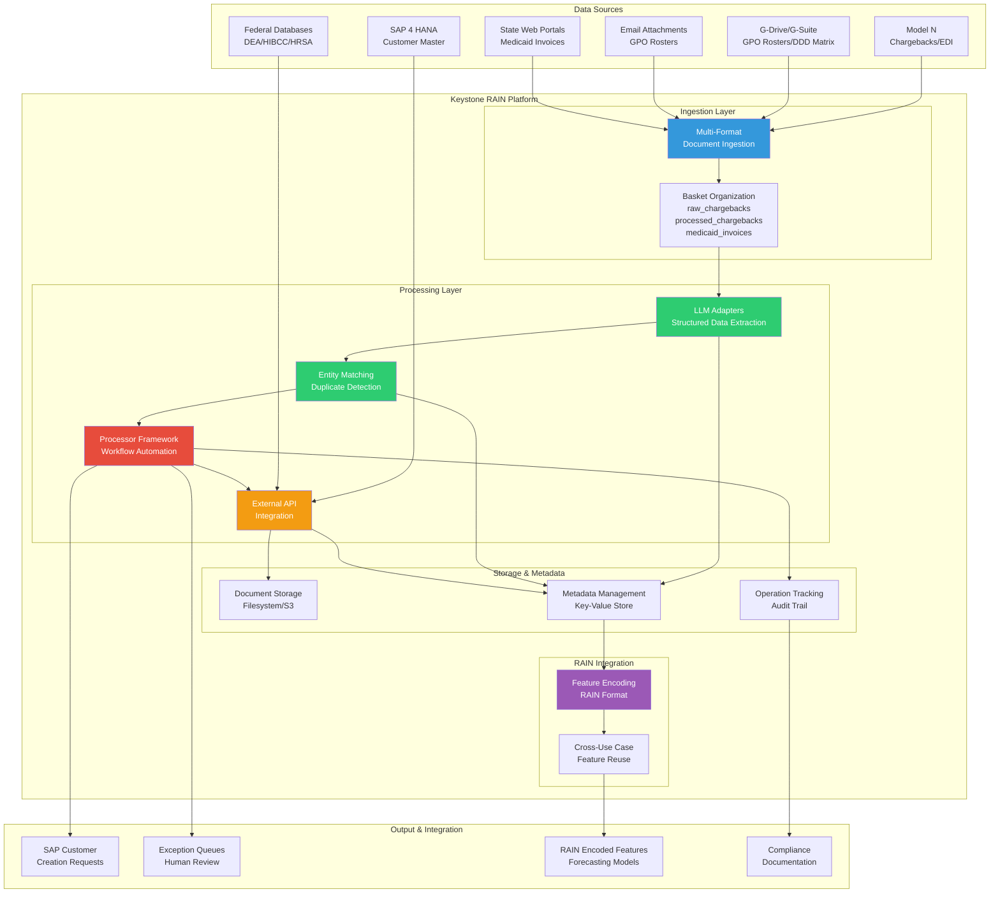
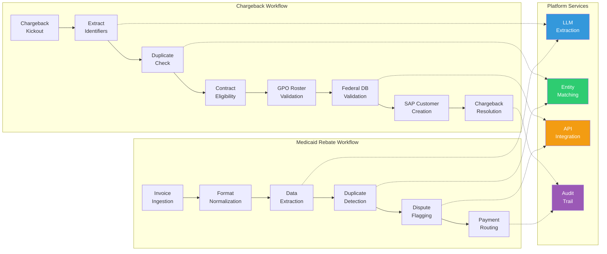
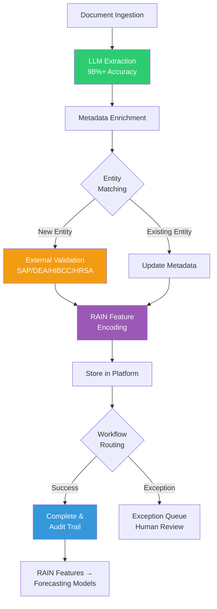
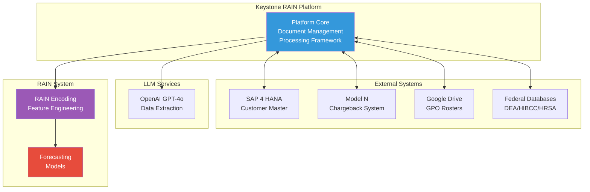

# Keystone RAIN Platform Architecture for Novartis MMF Use Cases

## High-Level Architecture Diagram

## Detailed Component Architecture

## Data Flow Architecture

## System Integration Architecture

## Use Case Coverage Matrix

| Platform Capability | Chargeback Use Case | Medicaid Rebate Use Case | Forecasting Use Case |
|---------------------|---------------------|-------------------------|----------------------|
| Document Ingestion | ✅ Model N, G-Drive, Email | ✅ State Portals, Email, NCPDP | ✅ Claim-level data |
| LLM Extraction | ✅ Customer IDs, Contract Info | ✅ Claim Details, NDC | ✅ Feature Extraction |
| Entity Matching | ✅ Duplicate Detection | ✅ Claim Deduplication | ✅ Entity Linking |
| Workflow Automation | ✅ 8-Step Process | ✅ Multi-Stage Pipeline | ✅ Data Prep Pipeline |
| External Integration | ✅ SAP, Federal DBs | ✅ State APIs | ✅ External Data Sources |
| Compliance/Audit | ✅ SOX Compliance | ✅ State Audit Support | ✅ Forecast Audit |
| RAIN Encoding | ✅ Customer Features | ✅ Claim Features | ✅ Forecasting Features |

